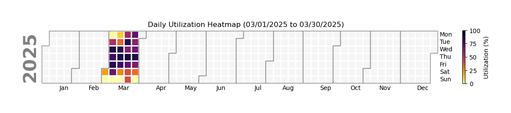
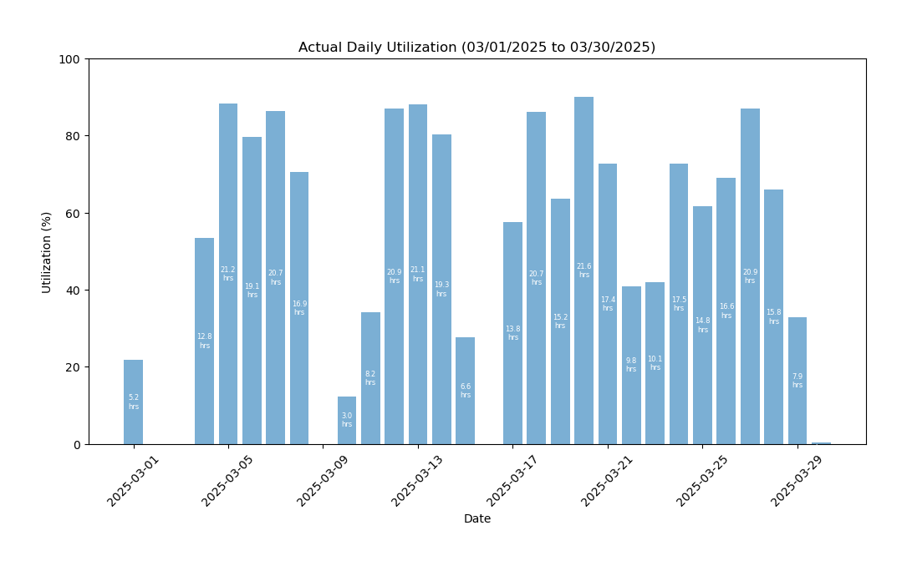
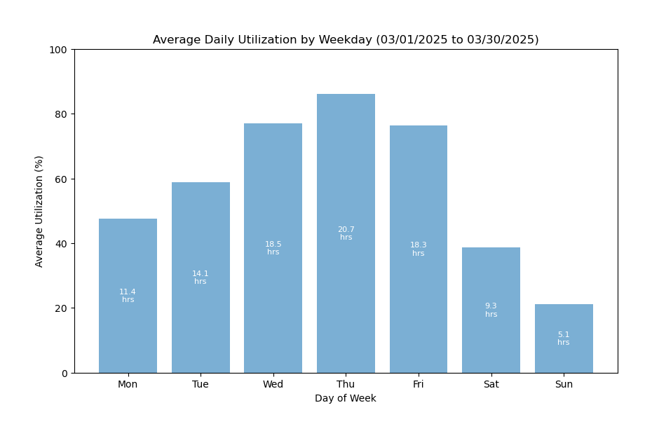
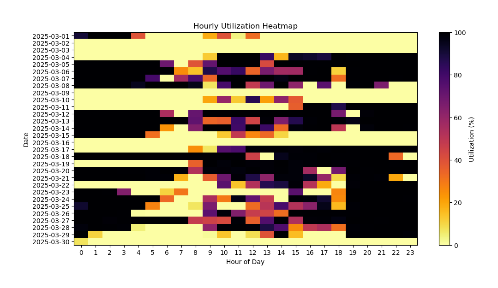
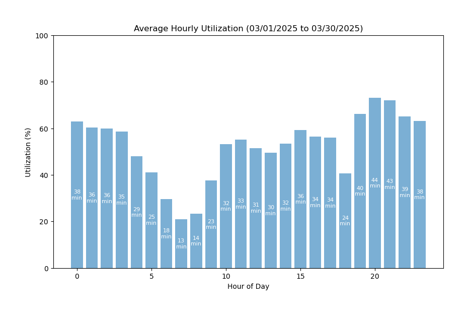
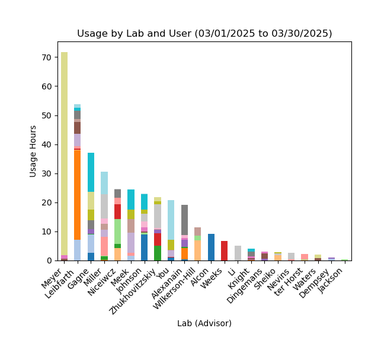
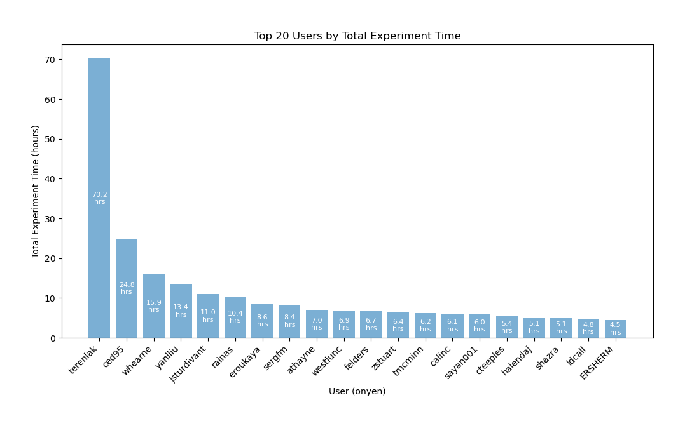
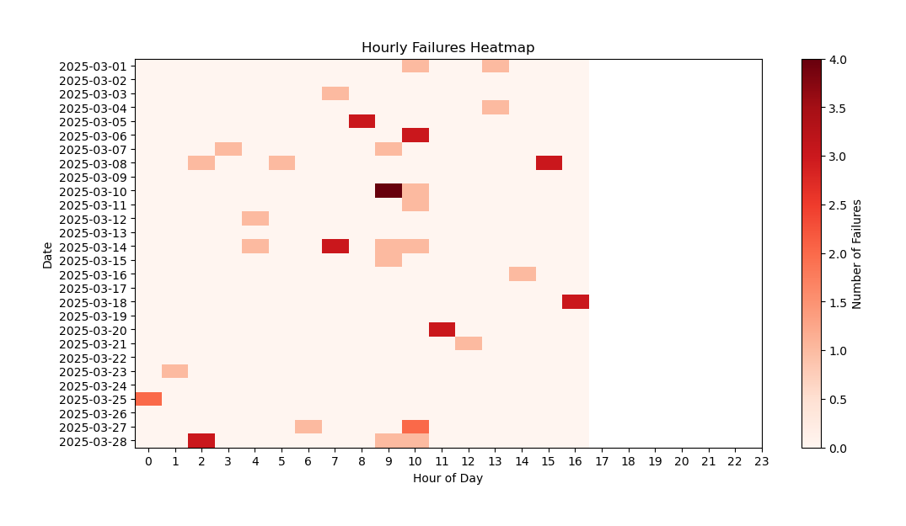
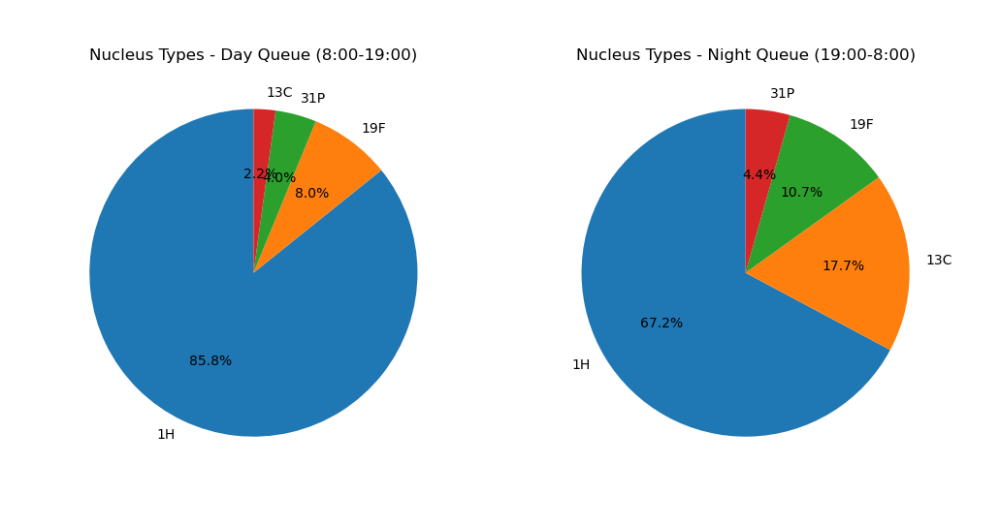

# NMR Billing Software

**Author**: Seth D. Veenbaas  
**Last updated**: 04/01/2025

## Overview

This repository contains two scripts (packaged as Windows .exe files) that work together to process Bruker formatted log files and generate chartfield strings (CFS) for billable NMR experiments.

1. **parse_bruker_logs.exe**  
   - Parses Bruker formatted log files (.full, .txt) to extract experiment details.
   - Exports the parsed data into a properly formatted CSV file.
   - The CSV file is designed as input for `generate_cfs.exe`.

2. **generate_cfs.exe**  
   - Reads the CSV from `parse_bruker_logs.exe` along with a PIF database Excel file (.xlsx).
   - Generates chartfield strings (CFS) for each experiment.
   - Saves successfully generated CFS into CSV files grouped by user affiliation in a subdirectory called `CFS`.
   - Saves incomplete CFS experiment data into a CSV file called `noCFS`.
   - Produces an Excel report combining all outputs.
   - Includes an overwrite protection feature; by default, the program will ask for confirmation before overwriting existing files unless the `--overwrite` flag is used.

## Required Input Files

### For `parse_bruker_logs.exe`

- **Bruker Log File:**  
    A Bruker formatted log file with extensions such as `.full` or `.txt`. These files contain the raw experiment details that will be parsed into a structured CSV format.

### For `generate_cfs.exe`

- **CSV File:**  
    The output CSV file generated by `parse_bruker_logs.exe`. This file contains the parsed experiment details required for generating chartfield strings. The CSV file must include the following columns:

    | Required Column Names | Description                         |
    | --------------------- | ----------------------------------- |
    | onyen                 | User inputted onyen ID              |
    | grant                 | User inputted grant ID              |
    | start_time            | Experiment start time (M/D/YYY H:M) |
    | end_time              | Experiment end time (M/D/YYY H:M)   |

- **PIF File:**  
    An Excel file (`.xlsx`) with People In Facility (PIF) database details used to map project IDs, program/cost codes, and user affiliations. The PIF file must include the following columns:
    
    | Required Column Names | Description                                                                                                |
    | --------------------- | ---------------------------------------------------------------------------------------------------------- |
    | onyen                 | The UNC assigned onyen for the NMR user (**user inputted**).                                               |
    | grant                 | The funding identifier (**user inputted**).                                                                |
    | affiliation           | User affiliation used for billing (e.g., NMR, UNC-CH, UNC-system, external-academic, external-commercial). |
    | fund                  | UNC fund code.                                                                                             |
    | source                | UNC source code.                                                                                           |
    | dept                  | UNC department code (e.g., chemistry: 318300).                                                             |
    | project_ID            | UNC project ID.                                                                                            |
    | program               | UNC program code.                                                                                          |
    | cost_code_1           | UNC cost code 1.                                                                                           |
    | cost_code_2           | UNC cost code 2.                                                                                           |
    | cost_code_3           | UNC cost code 3.                                                                                           |
    | PI                    | Name of the Primary Investigator (last name, first name).                                                  |

## Installation

Both scripts are distributed as Windows executable files. Download the latest version from the GitHub releases page, then unzip the package into a folder on your computer.

## Usage Instructions

### 0. Downloading the Executables

1. Visit the [GitHub repository](https://github.com/your-repo/NMR_billing).
2. Navigate to the `Releases` section or the `/dist` directory.
3. Download the latest version of `parse_bruker_logs.exe` and `generate_cfs.exe`.
4. Save the files to a folder on your computer for easy access.
5. Follow the [instruction](#steps-to-add-to-path) for adding the script to you PATHs so you can run the program from any directory on your computer.

### 1. Running parse_bruker_logs.exe

This program converts Bruker log files into a CSV file.

#### Steps:

1. Open the Windows Command Prompt (press **Win + R**, type `cmd`, press **Enter**).

2. Navigate to the folder containing `C:\path\to\log_file.full` using the `cd` command (change directory). For example:
   ```cmd
   cd C:\path\to\log_file.full
   ```

3. Run the executable with the Bruker log file as an argument. For example:
   ```cmd
   parse_bruker_logs.exe log_file.full -o output_directory
   ```
   - This will create a CSV file (e.g., `log_file.csv`) in the specified output directory.

4. Use the `--help` flag to view additional options such as generating reports:
   ```cmd
   parse_bruker_logs.exe --help
   ```

### 2. Running generate_cfs.exe

This program generates chartfield strings (CFS) from the CSV output and the PIF database.

#### Steps:

1. Open the Windows Command Prompt.

2. Navigate to the folder containing your log files (.csv) using the `cd` command (change directory):
   ```cmd
   cd C:\path\to\log_files_folder
   ```

3. Run the executable with the CSV file from `parse_bruker_logs.exe` and the PIF file:
   ```cmd
   generate_cfs.exe log_file.csv C:\path\to\pif_file.xlsx -i instrument_name -o C:\path\to\output_directory
   ```

   - The program will generate:
     - A set of CSV files with complete CFS (files named like `NEO400_UNC-CH_CFS.csv`, `NEO400_NMR-CORE_CFS.csv`, etc., based on user affiliation).
     - A CSV file with incomplete CFS data called `*_noCFS.csv`.
     - An Excel report aggregating all outputs (named like `NEO400_processed.xlsx`).

4. **Overwrite Protection:**  
   - If output files or directories already exist, the program will prompt you to confirm overwriting.
   - To bypass the prompt and allow automatic overwriting, add the `--overwrite` flag:
     ```cmd
     generate_cfs.exe C:\path\to\log_file.csv C:\path\to\pif_file.xlsx -o C:\path\to\output_directory --overwrite
     ```

5. Use the `--help` flag with `generate_cfs.exe` for more options:
   ```cmd
   generate_cfs.exe --help
   ```

## Post-processing

- **Correcting Incomplete Chartfield Strings:**
    1. Make changes to `pif.xlxs` such as adding onyen or new grant information.
    2. Make changes to the `*_noCFS.csv` file such as fixing user input typo.
    3. Re-run `generate_cfs.exe` with updated files.

- **Reports:**  
  The Excel report generated provides multiple sheets including all experiments, CFS grouped by affiliation, and failed CFS entries. Additional visual usage reports can be generated with the appropriate command-line flag (`--report`).

### Steps to Add to PATH

1. Locate the directory where `parse_bruker_logs.exe` is stored.
2. Press Win + R, type `sysdm.cpl`, and press Enter to open System Properties.
3. In the System Properties window, go to the "Advanced" tab and click "Environment Variables".
4. In the Environment Variables window, under "System variables", select the `PATH` variable and click "Edit".
5. Click "New" and add the full directory path where `parse_bruker_logs.exe` is located (e.g., `C:\path\to\parse_bruker_logs\dist`). You can copy this path directly by right-clicking on the directory in File Explorer and selecting "Copy address as text."
6. Click "OK" to save the changes, and close all dialogs.
7. Open a new command prompt window and test by entering `parse_bruker_logs.exe` from any directory.


## Features:
### v 1.0.0
- Users can bill multiple CFS in a single billing period.
- The reported PI name is sourced from the `pif.xlsx` file **not** from user input.
- Alcon and NMR Core usage is automatically extracted from internal billable usage.
- Automatic correction of user input errors, such as misspelled onyens or invalid grant identifiers.
- Automatically extracts Onyens (UNC usernames) from user-inputted UNC email addresses. **Note**: The email must follow the format `onyen@{domain}.edu` for accurate parsing.
- Generate reports to display instrument utilization (hourly and daily) and lab usage

### v 1.1.0

#### parse_bruker_logs

- Parses Bruker log files (.full, .txt) into a spreadsheet (.csv).
- Comprehensive reporting for completed experiments to visualize instrument utilization and usage

#### generate_cfs
- Uses parsed log files (.csv) and a people is facility spreadsheet (.xlxs) to generate chart field strings for billing (iLabs compatible).
- Separates outputs by user's affiliation (UNC-CH, external-commercial, etc.)
- Comprehensive reporting for completed experiments to visualize instrument utilization and usage

### v 1.2.0

#### parse_bruker_logs

- Valid start and end times required for a run to be 'billable'.

#### generate_cfs

- User inputted onyens are case insensitive.
- CLI argument (-i, --instrument) can be used to add instrument name to `CFS.csv`. [user, PI, instrument, CFS, start_time, end_time]. 

## Reports

The `-r` or `--report` argument in both the `parse_bruker_logs.exe` and `generate_cfs.exe` program will generate usage reports to visualize utilization (hourly and daily), lab/user usage, and failure data. View the `reports/summary_report.html` to view all the plots in onw document.

### Daily Utilization

| Daily Utilization Heatmap       | Daily Utilization Bar Chart           | Average Daily Utilization               |
| --------------------------------| --------------------------------------| --------------------------------------- |
| Visualizes daily usage patterns as a heatmap for easier trend identification. | Displays the total daily utilization of the lab across all users. | Shows the average daily utilization over a specified time period. |
|  |  |  |

### Hourly Utilization

| Hourly Utilization Heatmap       | Hourly Utilization Chart              |
| -------------------------------- | ------------------------------------- |
| Visualizes hourly usage patterns as a heatmap for easier trend identification. | Displays average hourly usage.          |
|  |  |

### Lab/User Usage

| Lab Usage                        | User Usage                            |
| -------------------------------- | ------------------------------------- |
| Provides a bar plot of lab (advisor) usage. | Provides a bar plot of the top 20 users (onyen). |
|  |  |

#### Troubleshooting Plots

| Failure Hourly Heatmap           | Experiment Type Distribution          |
| -------------------------------- | ------------------------------------- |
| Visualizes the hours with the most frequent failure rates. | Distribution of experiment nucleus for day and night queues. |
|  |  |


## Usage (Python)

You can run the Python version of the tool directly from the command line.

### Prerequisites

- **Python 3.9 or later** must be installed.
- Install required packages:
   ```bash
   pip install pandas openpyxl numpy matplotlib calplot
   ```

### How to Run

1. Open a terminal or command prompt.
2. Navigate to the folder containing the Python script (e.g., `parse_bruker_logs.py`).
3. Run the script with the following command:
    ```bash
    python parse_bruker_logs.py /path/to/log_file.csv /path/to/pif_file.xlsx -o /path/to/output_directory
    ```

#### Example

```bash
python parse_bruker_logs.py ./test/neo400_log_test.csv ./test/pif_test.xlsx -o ./test/output
```

The script will process your files and generate output reports, just like the Windows executable version.

