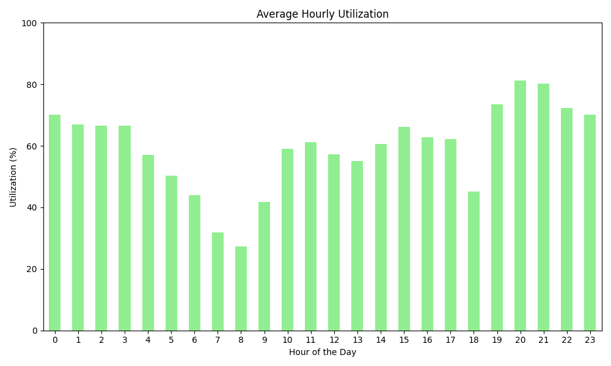
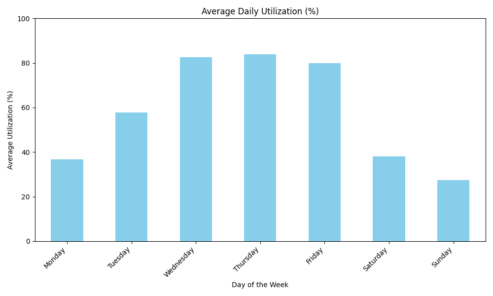
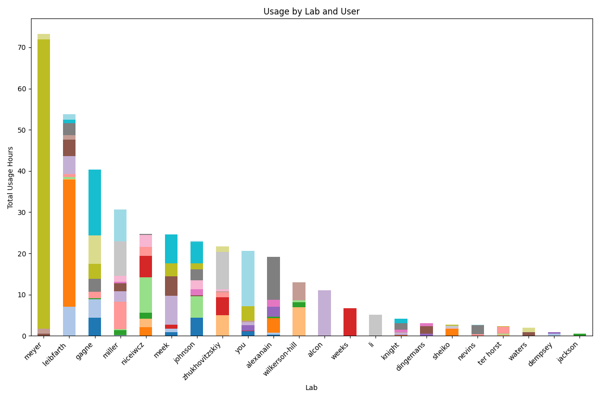

# Parse Bruker Logs

Author: Seth D. Veenbaas

Last updated: 04/01/2025

## Introduction
A Python tool to parse Bruker log files and generate reports for billable time and CFS.


## Required Input Files

This tool requires two types of input files:

1. Bruker Log File  
   - A Bruker NMR log file (.csv format) containing information about runs and events.
2. PIF File  
   - A file (.xlsx format) that holds the people in facility (PIF) database details used for mapping project IDs, program/cost codes, and related information.

   - Columns used by `parse_bruker_logs`:

       | Required columns | Description                                                       |
       | ---------------- | ----------------------------------------------------------------- |
       | onyen            | The UNC assigned onyen for NMR user. \***USER INPUTTED**\*        |
       | grant            | The identifier associated with the funding. \***USER INPUTTED**\* |
       | fund             | UNC fund code.                                                    |
       | source           | UNC source code.                                                  |
       | dept             | UNC department code (chemistry: 318300).                          |
       | project_ID       | UNC project ID.                                                   |
       | program          | UNC program code.                                                 |
       | cost_code_1      | UNC cost code 1.                                                  |
       | cost_code_2      | UNC cost code 1.                                                  |
       | cost_code_3      | UNC cost code 1.                                                  |
       | PI               | Name of the Primary Investigator (last_name, first_name).         |


## Generated Output Files

After processing, the tool produces several output files to help you review the parsed data. The table below provides a summary of each output file and its purpose:

| Output File                       | Description                                                             |
| --------------------------------- | ----------------------------------------------------------------------- |
| `runs_with_valid_CFS.csv`         | CSV file listing runs with valid CFS entries.                           |
| `runs_missing_or_invalid_CFS.csv` | CSV file listing runs with missing or invalid CFS values.               |
| `Alcon_report.csv`                | Specialized CSV report for runs billable to Alcon (external).           |
| `NMR_Core_report.csv`             | Specialized CSV report for runs logged by NMR Core staff.               |
| `full_processed_report.xlsx`      | Excel file containing a complete detailed report of all processed data. |


## Usage (Windows)

0. Locate and download the .exe file:
   - Visit the GitHub repository: https://github.com/yourusername/parse_bruker_logs
   - Navigate to the Releases section.
   - Download the latest `parse_bruker_logs.exe` file from the `dist` directory and save it to your computer.

1. Open the Windows command prompt:
   - Press Win + R, type cmd, and hit Enter.
2. Change the directory to where parse_bruker_logs.exe is located:
   - Use the cd command. For example:
     ```cmd
     cd C:\path\to\parse_bruker_logs
     ```
3. Run the files in the test directory:
   - Assuming your test files are located in a folder named `test`, you could run:
     ```cmd
     parse_bruker_logs.exe .\test\log_file.txt .\test\pif_file.txt -o output_directory
     ```
   - Example output:
     ```console
     Current working directory: C:\Users\Seth\OneDrive\Documents\GitHub\parse_bruker_logs\dist

     Processing log file: C:\Users\Seth\OneDrive\Documents\GitHub\parse_bruker_logs\dist\test\neo400_log_test.csv
     Using PIF database: C:\Users\Seth\OneDrive\Documents\GitHub\parse_bruker_logs\dist\test\pif_test.xlsx

     Success! Output saved to: C:\Users\Seth\OneDrive\Documents\GitHub\parse_bruker_logs\dist\test\output
       - neo400_log_test_CFS.csv: 4 completed runs with valid CFS
       - neo400_log_test_noCFS.csv: 1 run without valid CFS
       - neo400_log_test_Alcon.csv: 1 Alcon run
       - neo400_log_test_NMR_Core.csv: 1 NMR Core run
       - neo400_log_test_processed.xlsx: Full report with all data
     ```
4. For more details about program arguments, you can view the available options by running:
   ```cmd
   parse_bruker_logs.exe --help
   ```
   ```


## Add `parse_bruker_logs.exe` to PATH: run from anywhere

Following these steps makes it easier to run `parse_bruker_logs.exe` from any command-line interface without having to navigate to its installation folder each time.

### Steps to Add to PATH

1. Locate the directory where `parse_bruker_logs.exe` is stored.
2. Press Win + R, type `sysdm.cpl`, and press Enter to open System Properties.
3. In the System Properties window, go to the "Advanced" tab and click "Environment Variables".
4. In the Environment Variables window, under "System variables", select the `PATH` variable and click "Edit".
5. Click "New" and add the full directory path where `parse_bruker_logs.exe` is located (e.g., `C:\path\to\parse_bruker_logs\dist`). You can copy this path directly by right-clicking on the directory in File Explorer and selecting "Copy address as text."
6. Click "OK" to save the changes, and close all dialogs.
7. Open a new command prompt window and test by entering `parse_bruker_logs.exe` from any directory.


## New Features (v1.0.0):
- Users can bill multiple CFS in a single billing period.
- The reported PI name is sourced from the `pif.xlsx` file **not** from user input.
- Alcon and NMR Core usage is automatically extracted from internal billable usage.
- Automatic correction of user input errors, such as misspelled onyens or invalid grant identifiers.
- Automatically extracts Onyens (UNC usernames) from user-inputted UNC email addresses. **Note**: The email must follow the format `onyen@{domain}.edu` for accurate parsing.
- Generate report for utilization and usage:

   | Average Hourly Utilization                                       | Average Daily Utilization                                      | Lab Usage                              |
   | :--------------------------------------------------------------: | :------------------------------------------------------------: | :------------------------------------: |
   |  |  |  |

## Usage (Python)

You can run the Python version of the tool directly from the command line. Follow these steps:

### Prerequisites

Ensure you have Python 3.7 or later installed on your system. Install the required dependencies using pip:

```bash
pip install pandas openpyxl
```

### Running the Tool

To execute the script, open your terminal and navigate to the directory containing the Python source file (e.g., `parse_bruker_logs.py`). Then run the script as follows:

```bash
python parse_bruker_logs.py /path/to/log_file.csv /path/to/pif_file.xlsx -o /path/to/output_directory
```

### Example

```bash
python parse_bruker_logs.py ./test/neo400_log_test.csv ./test/pif_test.xlsx -o ./test/output
```

Upon execution, the script will process the provided files and generate the output reports similar to the executable version.

### Dependencies

- pandas
- openpyxl

```bash
pip install pandas openpyxl
```

